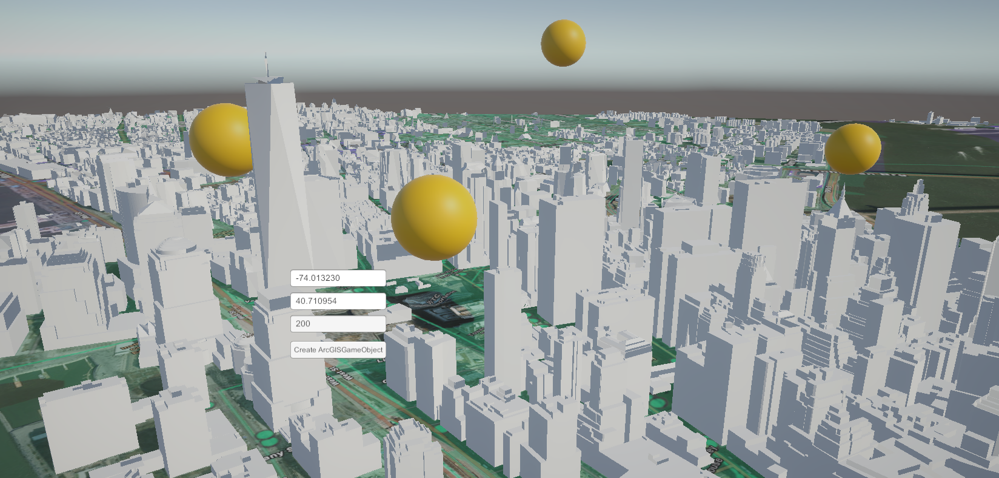
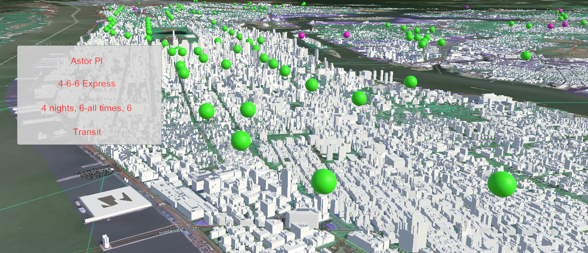
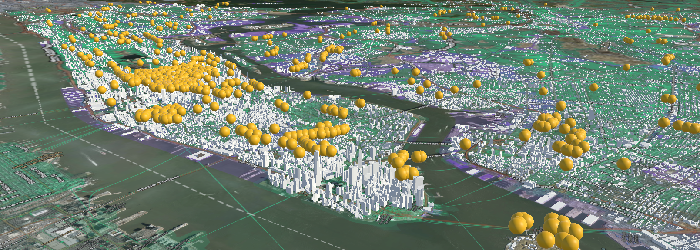

# ArcGIS-GameObjects

## Getting Started

Instantiate `ArcGISGameObjects` within the ArcGIS Map SDK for Unity to synchronize the global position of MonoBehaviour game objects.

## Installation

- Requires `Unity 2021.3.x` or higher
- Get [ArcGIS API Key](https://developers.arcgis.com/unity/authentication/)
- Install [ArcGIS Map SDK for Unity](https://developers.arcgis.com/unity/install-and-set-up/)
- Install [ArcGIS Map SDK for Unity Examples](https://developers.arcgis.com/unity/install-and-set-up/add-the-plugin-to-a-new-project/#import-sample-assets)

## Usage

Create ArcGISGameObjects using standalone data or create an API to retrieve realtime data.

Basic ArcGISGameObject Instantiation

```csharp
var position = new ArcGISPoint(longitude, latitude, altitude);
controller.CreateArcGISGameObject(position);
```

Sample NYCOpenData ArcGISGameObject Instantation

```csharp
// Create Wifi Hot Spot Positions
var wifiPositions = nycOpenDataApi.GetWifiLocations();
for(int i = 0; i < queryCount; i++)
{
    var wifiPosition = ArcGISGameObject.CreateArcGISGameObject(arcGISPrefab, parent);
    wifiPosition.SetPosition(wifiPositions[i]);
    wifiPosition.SetAltitude(altitude);
    arcGISGameObjects.Add(wifiPosition);
}
```

Generic Type Instantiation

```csharp
// Create TransitArcGISGameObject
var transitArcGISGameObject = ArcGISGameObject
.CreateArcGISGameObject<TransitArcGISGameObject>(prefab, parent);
```

*For more examples, please refer to the [Documentation](https://developers.arcgis.com/unity/)*

## Samples

### Create ArcGISGameObjects


### Local JSON transformed into ArcGISGameObjects


### Find Nearest Neighbor using Haversine Formula


### Create ArcGISGameObjects from API Data (Example: NYCOpenData)


## Contact

Contact

Caleb Vaccaro - [@sonicneptune](https://twitter.com/sonicneptune) - [calebvbusiness@gmail.com](calebvbusiness@gmail.com)

## Acknowledgments

- [Introducting ArcGIS Map SDK for Unity](https://www.esri.com/arcgis-blog/products/unity/announcements/introducing-arcgis-maps-sdk-for-unity/)
